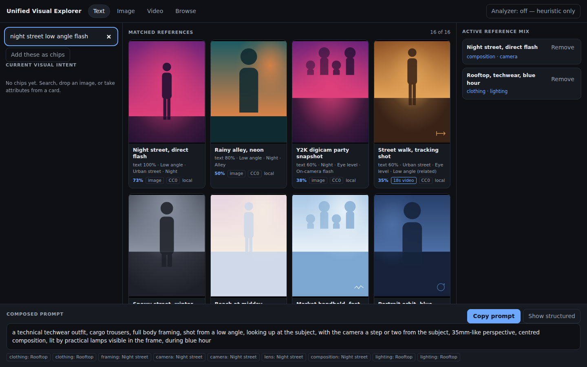

# Unified Visual Reference Composer

Search with words, images, videos or references; extract only the visual elements
you want, mix them together, and turn the result into a structured generation prompt.

> **한국어 요약:** 사진 A에서는 구도, 사진 B에서는 의상, 영상 C에서는 카메라 움직임만
> 골라 합쳐서 프롬프트를 만드는 도구입니다. 레퍼런스를 통째로 복사하지 않고 **속성 단위로
> 분해**하며, 각 요소가 어느 레퍼런스에서 왔는지 추적하고, 서로 충돌하면 몰래 하나를 고르지
> 않고 사용자에게 보여줍니다. AI 없이도 완전히 동작합니다.



## What makes it different

A prompt builder turns options into a prompt. An interrogator turns one image into
one description. A reverse image search finds pictures that look alike. None of them
let you say *this composition, that outfit, this lighting* — because none of them
model a reference as anything but a whole.

Here a reference is a bag of typed attributes, and five things follow:

- **One surface.** Text, image, video and browse are input *modes*, not screens.
  Switching between them never clears your intent, your mix or your results.
- **One data model.** Every input becomes the same `VisualIntent`: chips carrying a
  category, where they came from, a confidence, and whether you locked them.
- **Decomposition.** Each reference is split into eight groups you can take from
  separately — composition, camera, pose, clothing, lighting, scene, style, motion.
- **Selective inheritance.** Take only the parts you want from each reference.
- **Mixing, with conflicts visible.** When two references disagree about the camera
  angle, the app says so and names both sources. Nothing is deleted, and a prompt is
  still produced.

## Status

**v0.1 works.** The whole path runs end to end with no model and no network:
search → cards → take attributes → mix → prompt.

| Area | State |
|---|---|
| Explorer UI, four modes, mix tray, conflict UI, prompt + copy | working |
| AI-free search: aliases, metadata coverage, fusion, per-result explanation | working |
| Search by Difference (keep / change) | working |
| Taxonomy: 740 nodes, 10 files, all 20 categories | working |
| Seed library: 16 references, no media bytes | working |
| Optional image analyzer (OpenAI-compatible endpoint) | working, off by default |
| Pin, exploration history | not yet — see [`docs/MVP_V0.1_TASKS.md`](docs/MVP_V0.1_TASKS.md) |
| Live Openverse / Wikimedia providers, embeddings, video analysis, ComfyUI node | later milestones, see [`docs/ROADMAP.md`](docs/ROADMAP.md) |

## Run it

ES modules need an HTTP server; `file://` will not work.

```sh
python3 -m http.server 8765      # or: npm start
# then open http://localhost:8765/app/index.html
```

There is no build step and no runtime dependency.

```sh
npm run check    # taxonomy + schema + documentation integrity, then the tests
npm test         # behavioural tests for the core
npm run seed     # regenerate data/references.json
```

## AI is optional

With the analyzer off — the default — everything above works: browsing, keyword
search over aliases, metadata search, decomposition, mixing, conflicts and the
composer. Turning it on adds one thing: dropping an image proposes chips, which you
then edit. Nothing is hardcoded to a model or a vendor; you supply an endpoint and a
model name in Settings, and they are stored in your browser and sent nowhere else.

Analysis of your own images and video happens locally or against the endpoint you
name. Nothing is uploaded anywhere by default.

## Layout

```
app/           the shell: one dialog, one stylesheet
src/core/      taxonomy, visual intent, reference mix, ids, canonical constants
src/search/    query expansion, scoring, fusion, search by difference
src/prompt/    structured prompt and the generic formatter
src/reference/ the library and licence classification
src/ai/        the analyzer adapter (optional backends)
src/ui/        the explorer and the procedural card art
data/taxonomy/ 740 nodes across 10 files
data/          references.json — the generated seed library
tools/         gen-seed.mjs
tests/         behavioural tests and three integrity checkers
docs/          the brief, the design documents, and the research behind them
```

## Documentation

Start with [`docs/PRODUCT_BRIEF.md`](docs/PRODUCT_BRIEF.md) — it is the founding
specification and wins over every other document.

| Document | What it is for |
|---|---|
| [PRODUCT_BRIEF](docs/PRODUCT_BRIEF.md) | the requirements, plus amendments made since |
| [PRODUCT_VISION](docs/PRODUCT_VISION.md) | why this exists and what it must never become |
| [ARCHITECTURE](docs/ARCHITECTURE.md) | module boundaries and the rules that keep them |
| [DATA_SCHEMA](docs/DATA_SCHEMA.md) | every persisted structure, with worked examples |
| [SEARCH_ARCHITECTURE](docs/SEARCH_ARCHITECTURE.md) | retrieval, scoring and difference search |
| [UNIFIED_MODAL_STATE](docs/UNIFIED_MODAL_STATE.md) | the explorer state machine |
| [MVP_V0.1_TASKS](docs/MVP_V0.1_TASKS.md) | what v0.1 is, in twelve tasks |
| [ROADMAP](docs/ROADMAP.md) | v0.2 onward, and the gate to a ComfyUI node |
| [LICENSE_POLICY](docs/LICENSE_POLICY.md) | which reference licences are allowed, and why |
| [COMPETITIVE_ANALYSIS](docs/COMPETITIVE_ANALYSIS.md) | the landscape, and the gap this fills |
| [THIRD_PARTY_REVIEW](docs/THIRD_PARTY_REVIEW.md) | what was surveyed and what was deliberately not taken |
| [DESIGN_QUESTIONS](docs/DESIGN_QUESTIONS.md) | the nine questions the design had to answer |

Machine-readable contracts live in [`docs/schemas/`](docs/schemas/) — seven JSON
Schemas that the app loads at runtime rather than duplicating in code.

## Licensing

The code is MIT (see [`LICENSE`](LICENSE)). **Reference media is licensed separately
from the code.** Every reference carries its own licence, creator and attribution,
and the seed library is CC0 with no media bytes stored in this repository at all —
each card is drawn from its own attributes. The rules for which licences may enter
the product are in [`docs/LICENSE_POLICY.md`](docs/LICENSE_POLICY.md); third-party
provenance is recorded in [`THIRD_PARTY_NOTICES.md`](THIRD_PARTY_NOTICES.md).

Sourcing that is never acceptable: scraping Pinterest, Instagram or TikTok, bulk
copying prompt databases, or storing media whose licence is unknown.

## Non-goals

Not a generic prompt builder. Not an image-to-prompt tool. Not a reverse image
search. Not a prompt gallery. If those are what you need, several good ones exist and
[`docs/COMPETITIVE_ANALYSIS.md`](docs/COMPETITIVE_ANALYSIS.md) names them.
